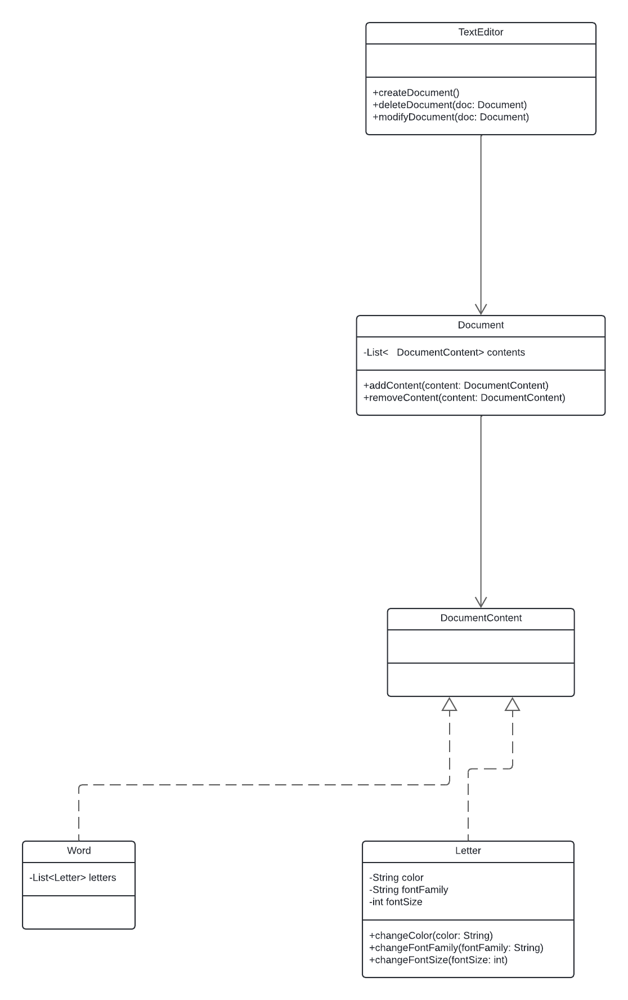

# Editor de texto

Se desea modelar un editor de texto. El mismo permite crear documentos. De un documento sabemos su nombre, fecha de creación y fecha de ultima modificación, inicialmente estas coinciden pero posteriormente una es estática y potencialmente, la otra cambia con el tiempo)
Un editor permite crear, eliminar un documento dado.

## Diagrama inicial

[Ver el diagrama de Lucidchart](https://www.lucidchart.com/documents/enlace-al-diagrama)
